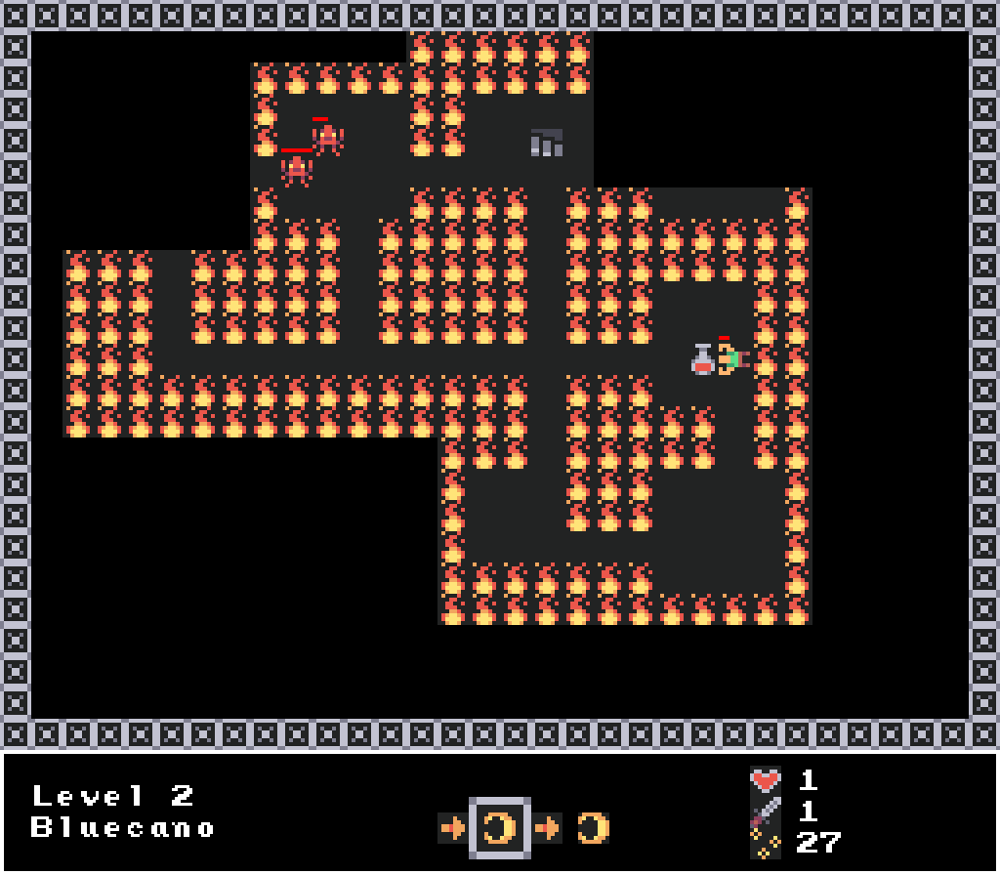

# Eye of the Beatholder

> A One-Button Rythm Roguelike made with Godot 3 for the [1-Button Jam 2022](https://itch.io/jam/1-button-jam-2022)

# About

> Under the gaze of the Beatholder, every soul is bound to its heart beat. Can you make it to its lair and end its reign?

Eye of the Beatholder is a *One Button Rythm Roguelite*, heavily inspired by *Crypt of the Necrodancer*. Press the Spacebar on odd beats to move forward or attack enemies in front of you. Press the Spacebar on even beats to rotate your character to the right. The final boss is actually pretty tough, so make sure to collect some damage upgrades before fighting him.

**Thanks for playing and have fun!**

# Used Assets

- Kenney: [Micro Roguelike](https://www.kenney.nl/assets/micro-roguelike)
- Pro Sensory: [Adventure Time](https://opengameart.org/content/adventure-time-1)
- Matthew Pablo: [A Conversation with Saul](https://opengameart.org/content/a-conversation-with-saul-jazzblues-shuffle)
- Matthew Pablo: [Orbital Colossus](https://opengameart.org/content/orbital-colossuslooping)
- Zander Noriega: [Dragged Through Hellfire](https://opengameart.org/content/dragged-through-hellfire)
- Cleyton Kauffman: [Continue Theme](https://opengameart.org/content/continue-theme)
- Title Art by [Midjourney AI](https://www.midjourney.com)

